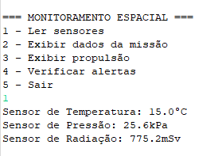
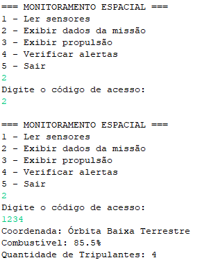
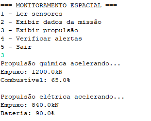
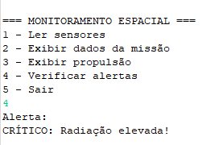
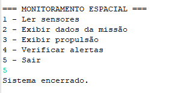

# Global Solution 2026 - Programação Orientada a Objetos

## Plataforma de Monitoramento Espacial

### Integrantes

**Fernando - RM: 564820**

**Gabriel - RM 563520**

**Guilherme - RM 562494**

---

## Sobre o Projeto

Este projeto foi desenvolvido para a Global Solution 2026 da disciplina de Programação Orientada a Objetos.

A aplicação simula uma plataforma de monitoramento espacial responsável por acompanhar informações de uma missão, realizar a leitura de sensores, controlar sistemas de propulsão e emitir alertas quando condições críticas forem detectadas.

O sistema foi implementado em **Java**, utilizando os principais conceitos de Programação Orientada a Objetos abordados durante o semestre.

---

## Conceitos de POO Aplicados

### Classe Abstrata

Foram utilizadas classes abstratas para representar estruturas genéricas do sistema:

- `ComponenteEspacial`
- `SistemaPropulsao`

Essas classes servem como base para outras classes mais específicas, evitando repetição de código e promovendo reutilização.

### Interface

A interface `Sensor` define comportamentos comuns para todos os sensores do sistema, garantindo padronização na implementação dos métodos.

### Encapsulamento

A classe `DadosMissao` utiliza atributos privados e métodos de acesso (*getters* e *setters*) para proteger informações importantes da missão.

Além disso, algumas informações possuem validações específicas, como:

- Controle do nível de combustível;
- Proteção das coordenadas da missão;
- Verificação de acesso por código de segurança.

### Herança

As seguintes classes herdam características de suas classes base:

#### Sensores

- `SensorTemperatura`
- `SensorPressao`
- `SensorRadiacao`

Todas herdam de:

```java
ComponenteEspacial
````

#### Sistemas de Propulsão

* `PropulsaoQuimica`
* `PropulsaoEletrica`

Ambas herdam de:

```java
SistemaPropulsao
```

### Polimorfismo

Os diferentes sistemas de propulsão implementam comportamentos próprios para aceleração e cálculo de empuxo, demonstrando a sobrescrita de métodos e o uso do polimorfismo.

---

## Funcionalidades Implementadas

✅ Leitura dos sensores da missão

✅ Monitoramento de temperatura

✅ Monitoramento de pressão

✅ Monitoramento de radiação

✅ Controle de propulsão química

✅ Controle de propulsão elétrica

✅ Cálculo de empuxo

✅ Controle do combustível

✅ Proteção das coordenadas da missão

✅ Sistema de alertas automáticos

✅ Menu interativo para navegação

---

## Estrutura do Projeto

O sistema é composto pelas seguintes classes:

```text
ComponenteEspacial
Sensor
SensorTemperatura
SensorPressao
SensorRadiacao
DadosMissao
SistemaPropulsao
PropulsaoQuimica
PropulsaoEletrica
SistemaMonitoramento
```

---

# Demonstração do Sistema

## Leitura dos Sensores



---

## Exibição dos Dados da Missão

*Acesso permitido apenas mediante código de segurança válido.*



---

## Sistema de Propulsão



---

## Sistema de Alertas



---

## Encerramento do Sistema



---

## Conclusão

Este projeto permitiu aplicar na prática os principais conceitos de Programação Orientada a Objetos estudados durante o semestre:

* Classe Abstrata
* Interface
* Encapsulamento
* Herança
* Polimorfismo

Além de atender aos requisitos da Global Solution, o sistema demonstra como diferentes componentes podem trabalhar de forma integrada para auxiliar no monitoramento e gerenciamento de uma missão espacial.
